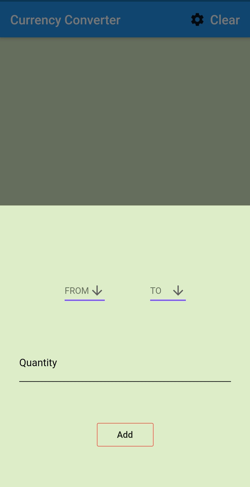
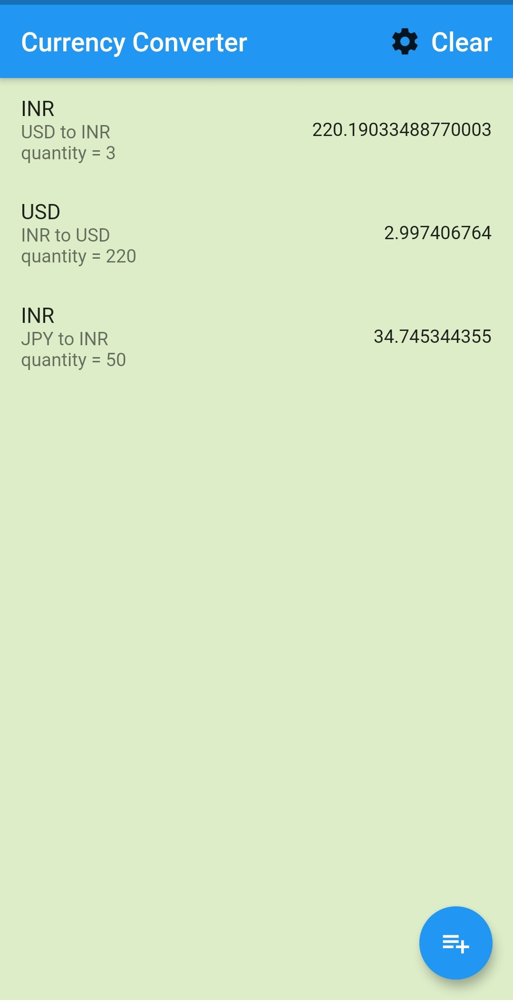

## Currency Converter Flutter App

In these you can check Currency current foreign exchange rates.

<h2>ScreenShots:</h2>

 

<h2>Demonstration Video:</h2>

# Support :

If you found this project helpful or you learned something from the source code and want to thank me, consider me to pay my internet bills. This would encourage me to create many such projects 👨🏻‍💻

<ul>
    <li><a href="https://www.paypal.me/kevalsenghani171"><b>PayPal</b></a></li>
    <li><b>Google Pay UPI ID :</b> senghanikeval@okhdfcbank</li>
</ul>
